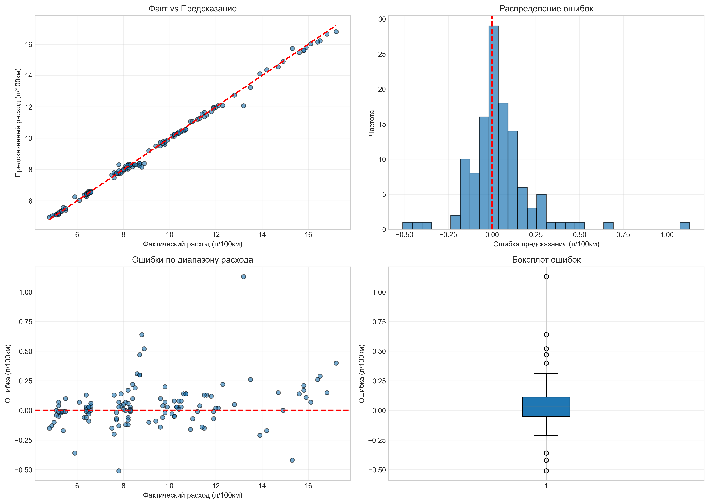
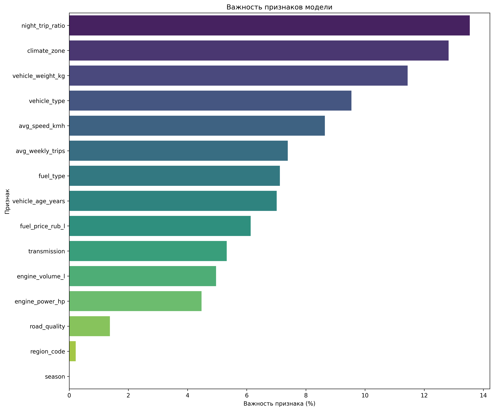

#  Прогноз расхода и стоимости топлива в РФ

Модель + веб-обертка, предназначенная для расчета расхода топлива и предсказания стоимости поезки на разные дистации. Модель учитывает параметры автомобильного средства, регион и условия эксплуатации. 

## Как установить?

1. Для начала клонируйте репозиторий
```bash
git clone https://github.com/your-username/fuel-prediction-ru.git
cd fuel-prediction-ru
```
2. Создайте ВО и установите зависимости 
```bash
python -m venv venv
source venv/bin/activate  # Linux/macOS

.\venv\Scripts\activate    # Windows

pip install -r requirements.txt
```
3. Обучите модельку и зепустите веб-сервер
```bash
python train.py --data data/train/fuel_consumption_train.csv --output models/catboost_ru_v1.cbm

python app.py
```
Откройте в браузере: `http://localhost:5000`

---

## О модели
Для задачи прогнозирования расхода топлива был выбран CatBoost 
### Гиперпараметры
```python
CATBOOST_PARAMS = {
    "iterations": 1000,          
    "learning_rate": 0.03,        
    "depth": 6,                  
    "loss_function": "RMSE",     
    "eval_metric": "MAE",        
    "random_seed": 42,           
    "verbose": 100,              
    "early_stopping_rounds": 50, 
    "cat_features": FEATURES_CATEGORICAL,  
}
```
1. Максимальное количество деревьев
2. Шаг градиентного спуска
3. Глубина каждого дерева
4. Функция потерь для регрессии
5. Метрика для early stopping
6. Воспроизводимость результатов
7. Лог каждые 100 итераций

--- 
## Признаки
**Числовые (8):** объём двигателя, мощность, масса авто, возраст, средняя скорость, доля ночных поездок, поездки в неделю, актуальная цена топлива.  
**Категориальные (7):** тип кузова, тип топлива, коробка передач, климатическая зона, качество дорог, сезон, код региона.  
Моделька автоматически подтягивает цены из `data/fuel_prices_ru.json` 

---

## Результаты оценки 
### Метрики качества

| Метрика | Значение | 
|---------|----------|
| **R² (коэффициент детерминации)** | 0.9961 | 
| **MAE (средняя абсолютная ошибка)** | 0.121 л/100км |
| **RMSE (среднеквадратичная ошибка)** | 0.193 л/100км |
| **MAPE (средняя процентная ошибка)** | 1.3% | 
| **Max Error (максимальная ошибка)** | 1.13 л/100км | 

#### Распределение ошибок предсказания



#### Важность признаков




#### Метрики в деталях
 [metrics.json](reports/metrics.json) — полные метрики в формате JSON
## Ссылка на сайт с ценами 
[benzin-price.ru](https://www.benzin-price.ru/)
